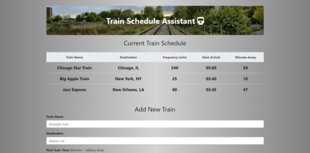

# Train Scheduler

## Contributors

kd101jp14

## Technology

* HTML5

* CSS3

* Bootstrap 4

* JavaScript

* jQuery 3

* Moment.js

* Firebase

## Live demo:
https://kd101jp14.github.io/train_scheduler/

## About

This project allows users to input train information and view relevant data in a table. Using Moment.js, the app calculates the train's next arrival time and how many minutes remain until the next train. In addition to the Moment.js calculations, the other key feature of this web application is the data persistence of information displayed in the table. The user's input and the related calculated values are stored in a Firebase database (server-side storage). Each time a user adds a new train, that train's information prepends to the top of the table in real time and persists on the page.

### The Challenge

The challenge of this project was calculating the next train arrival and minutes until the next train using Moment.js.
This challenge was overcome by working out examples of these problems using simple math and then incorporating the Moment.js library into each step along the way. This solution meant understanding the this library's documentation.

## Screenshot

## License

* This project does not have a license and is not currently open for contributions. Suggestions are welcome.

## Contact

* Homepage:  https://github.com/kd101jp14

* E-mail: davis.kyra@rocketmail.com
